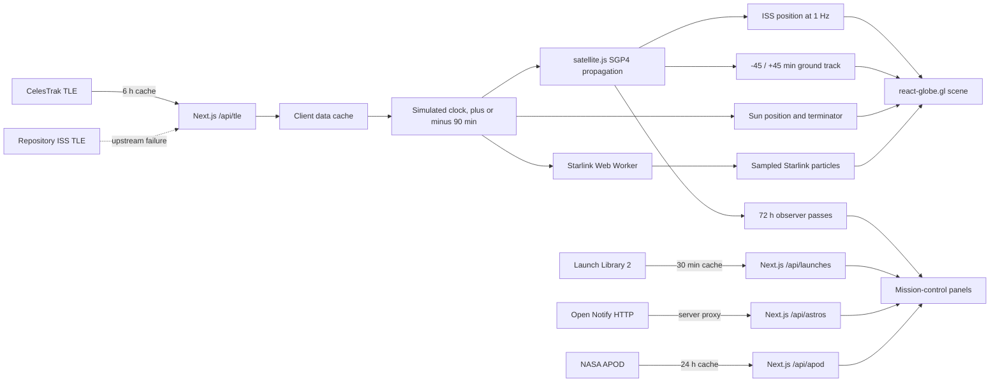

# ORBITAL — Live Space Dashboard 🛰️

**A portfolio-grade, real-time 3D view of human activity in low Earth orbit.** ORBITAL propagates the ISS locally from cached two-line elements, predicts visible passes for the observer, and turns upcoming launch data into a cinematic mission-control interface.


<sub>Captured from a production build (`npm run build && npm run start`) at 2026-09-21T10:38Z, commit `563775e`, propagating CelesTrak element set `26264.17466374`. `/api/tle/iss` was read immediately before and after both captures and returned the same element set, so the two images describe one orbit state rather than whatever the fetch cache happened to hold — an earlier attempt was discarded because the set revalidated mid-capture. Nothing in the frame is mocked: the pass times, crew count, clocks and launch manifest are what the running app produced. Taken at a 1440×900 viewport (375×812 for the second) at 2× device pixel ratio and downscaled for the repository; the pixels are resampled, the content is not. Both frames show the default first screen, which is why the Starlink layer reads OFF — it is opt-in and stays unfetched until a visitor asks for it. The 375 px capture is [here](./public/screenshots/orbital-mobile-375.png).</sub>

> **Status — all three roadmap phases are built.** Every objective ships as its own pull request, and `scripts/ship-pr.mjs` refuses to merge one without CI plus two independent review verdicts bound to the exact commit being merged. The unit suite and the end-to-end suite both run on every pull request, the latter across a desktop and a 375 px viewport as two separate checks, alongside lint, typecheck, a production build, CodeQL and a first-load byte budget.
>
> Two Definition-of-Done items are **not** met and are not presented as if they were: there is still no public deployment, so no demo URL appears anywhere in this repository. The pass prediction has also not been compared against an external predictor by a human. Both are tracked openly in [`docs/PHASE_1_DOD.md`](./docs/PHASE_1_DOD.md). No deployment URL, Lighthouse score or accuracy figure appears here until it has actually been measured — and the same rule is enforced on the engineering numbers: figures live in regenerable artefacts under [`docs/perf/`](./docs/perf/) and [`docs/a11y/`](./docs/a11y/), not in prose, because a figure nothing regenerates is checked by nothing.

## The first-screen experience

- Night Earth and procedural star field rendered with `react-globe.gl`
- ISS position propagated at 1 Hz with `satellite.js`; no position API polling
- Separate past and future 45-minute ground tracks, split at the antimeridian
- Observer-specific 72-hour pass forecast using twilight, illumination and elevation gates
- Live launch countdowns, launch-pad globe focus, UTC/local clocks and crew count
- A ±90-minute time control: one simulated clock drives the marker, the ground track, the terminator and the Starlink layer from the same instant
- A day/night terminator and an explainable sun state, derived from that same instant
- An opt-in Starlink layer — a deterministic sample propagated in a Web Worker and drawn as one particle system, off until asked for
- A shareable observer link that outranks browser geolocation and is rounded on the way out
- Loading, stale, empty and unavailable are designed states on the launch panel and the globe; the crew chip is the exception and shows its offline copy until the first response lands (tracked in [`docs/PHASE_1_DOD.md`](./docs/PHASE_1_DOD.md))
- The ISS route alone also has a committed TLE fixture behind it; the other three degrade to a typed error once their warm cache is gone

The visual direction is deep navy/black, restrained cyan and violet telemetry, soft atmosphere, glass instrumentation and cinematic motion with a reduced-motion path.

## Run locally

```bash
npm install
npm run dev
```

Open `http://localhost:3000`. No private runtime API key is required. `NASA_API_KEY` is optional for the Phase 2 APOD card.

To deploy, see [`docs/DEPLOYMENT.md`](./docs/DEPLOYMENT.md) — it needs no secret, no database and no `vercel.json`. For the complete autonomous setup, read [`START_HERE_TR.md`](./START_HERE_TR.md).

## Architecture



### Why client-side propagation?

TLE changes slowly; position changes continuously. Fetching the orbital elements on the server every six hours and propagating any requested timestamp locally gives smooth motion, near-zero upstream pressure, natural time simulation, reproducible pass calculations and useful behavior during transient API failures.

### Resilience model

Each server route validates the upstream response and applies a timeout. Warm server instances can return last-good data; the ISS route has an additional repository fixture. Client panels treat loading, stale, empty and unavailable as designed states rather than exceptions. A launch or crew outage must never take down the globe.

## Core stack

- Next.js App Router + TypeScript strict
- `react-globe.gl` / Three.js
- `satellite.js`
- Tailwind CSS
- Recharts
- SWR
- Vitest + Playwright
- Vercel deployment target

## Test strategy

```bash
npm run lint
npm run typecheck
npm run test
npm run test:coverage
npm run build
npm run test:e2e -- --project=desktop-chromium
npm run test:e2e -- --project=mobile-375
npm run verify
```

Orbital tests use deterministic UTC dates and physical invariants: latitude/longitude bounds, LEO altitude and velocity ranges, chronological pass geometry, visibility gates and antimeridian segmentation. Network behavior is tested at the normalization/proxy boundary with mocked upstreams. Mobile E2E enforces a 375 px no-overflow contract.

CI runs lint, typecheck, the unit suite with coverage, a production build, the first-load byte budget, and the full end-to-end suite against **both** Playwright projects, each reporting as its own check. Coverage is measured over the orbital mathematics and the four gateway routes, not repository-wide: components and hooks are deliberately outside that denominator and are covered end-to-end instead. The floors CI enforces are 80% of lines, statements and functions and 70% of branches ([`vitest.config.ts`](./vitest.config.ts)); the suite runs well above all four.

Counts and percentages are not quoted here. `npm run test:coverage` prints both in a few seconds, and this repository has already shipped a README claiming coverage figures that were wrong by the time anyone read them. A number nothing regenerates is checked by nothing — the same rule that keeps byte counts in [`docs/perf/`](./docs/perf/) rather than in prose.

Resilience is treated as behaviour to assert, not a hope. `e2e/resilience.spec.ts` breaks each upstream in turn — and all three at once — and requires the surface that *owns* the broken feed to name the failure. An outage may not render as an empty state, and an empty response may not render as an outage.

See [`docs/TEST_STRATEGY.md`](./docs/TEST_STRATEGY.md) and [`docs/QUALITY_GATES.md`](./docs/QUALITY_GATES.md).
The package-time validation boundary is recorded in [`docs/PACKAGE_VALIDATION.md`](./docs/PACKAGE_VALIDATION.md).

## Autonomous engineering workflow

The repository is designed to produce an unusually legible public engineering narrative:

```text
roadmap objective → objective branch → red test → implementation → QA review
→ code review → CI → squash PR merge → next dependency-ready objective
```

`CLAUDE.md`, `.claude/agents/`, `.claude/rules/`, `.claude/skills/`, hooks and `goals/roadmap.json` make Claude Code resume work without repeated product questions. Editing agents use isolated worktrees; the lead alone integrates and ships. `setup:github` publishes the machine roadmap as linked issues, while the PR gate enforces allowed paths, chronological TDD evidence, conventional commits and two current-SHA review verdicts.

```bash
npm run doctor                               # toolchain preflight
npm run claude:auto                          # interactive autonomous lead
npm run autopilot -- --phase phase-1         # MVP-only headless objective loop
npm run mission                               # Phase 1 → 2 → 3, merge-gated
npm run goals -- status                      # local execution ledger
npm run ship:pr -- --objective P1-03         # verify, PR, checks, squash merge
npm run setup:github                          # publish the roadmap as linked issues
npm run update:fallback-tle                  # refresh the committed ISS fixture
npm run textures                              # regenerate the procedural globe assets
```

## Roadmap

**Phase 1 — built.** Hardened gateways ([#28](https://github.com/MertArtun/orbital/pull/28)), verified propagation ([#29](https://github.com/MertArtun/orbital/pull/29)), cinematic ISS globe ([#30](https://github.com/MertArtun/orbital/pull/30)), visible passes ([#31](https://github.com/MertArtun/orbital/pull/31)), mission-control panels ([#33](https://github.com/MertArtun/orbital/pull/33)), resilience/mobile/a11y gates ([#34](https://github.com/MertArtun/orbital/pull/34)), on a reproducible toolchain ([#24](https://github.com/MertArtun/orbital/pull/24)).

**Phase 2 — built.** Reduced-motion marker fix ([#41](https://github.com/MertArtun/orbital/pull/41)), worker-propagated Starlink sample ([#45](https://github.com/MertArtun/orbital/pull/45)), ±90-minute simulated time ([#47](https://github.com/MertArtun/orbital/pull/47)), terminator/shadow detail and APOD ([#48](https://github.com/MertArtun/orbital/pull/48)), idle globe rotation before the first fix ([#49](https://github.com/MertArtun/orbital/pull/49)).

**Phase 3 — built.** Shareable observer URLs ([#50](https://github.com/MertArtun/orbital/pull/50)) and measured performance and accessibility ([#52](https://github.com/MertArtun/orbital/pull/52)), which moved the telemetry chart off the first load, cut the initial payload by roughly a third against a budget CI now enforces on every pull request, and cleared every contrast finding at both viewports. The byte counts are in [`docs/perf/production-baseline.json`](./docs/perf/production-baseline.json) and the over-canvas contrast measurements in [`docs/a11y/ink-contrast.json`](./docs/a11y/ink-contrast.json), regenerated by one command each — this sentence deliberately carries none of them. Its decisions and the defects found while attacking its own gates are in [ADR 0009](./docs/adr/0009-performance-measurement-policy.md). This release is the final objective.

What shipped in each objective and the engineering decision behind it are in [`docs/RELEASE_NOTES.md`](./docs/RELEASE_NOTES.md). The machine-readable acceptance criteria and dependencies are in [`goals/roadmap.json`](./goals/roadmap.json).

## Data and asset notes

- CelesTrak supplies orbital elements; clients do not call it directly.
- Launch Library 2 supplies upcoming launch metadata.
- Open Notify is proxied server-side because its public endpoint is HTTP.
- The included Earth/star textures are procedurally generated project assets, so the repository carries no third-party image licence. Regenerate them with `npm run textures` (`scripts/generate-textures.py`). Replace them only with assets whose license and attribution are recorded.
- Embedded city coordinates are approximate city-centre values and are not suitable for navigation.

## Portfolio evidence checklist

Ticked only where the evidence exists in this repository. Everything unticked is
genuinely outstanding.

- [x] Every objective in all three phases merged through CI as one squashed PR each — Phase 1 [#24](https://github.com/MertArtun/orbital/pull/24), [#28](https://github.com/MertArtun/orbital/pull/28), [#29](https://github.com/MertArtun/orbital/pull/29), [#30](https://github.com/MertArtun/orbital/pull/30), [#31](https://github.com/MertArtun/orbital/pull/31), [#33](https://github.com/MertArtun/orbital/pull/33), [#34](https://github.com/MertArtun/orbital/pull/34), [#36](https://github.com/MertArtun/orbital/pull/36); Phase 2 [#41](https://github.com/MertArtun/orbital/pull/41), [#45](https://github.com/MertArtun/orbital/pull/45), [#47](https://github.com/MertArtun/orbital/pull/47), [#48](https://github.com/MertArtun/orbital/pull/48), [#49](https://github.com/MertArtun/orbital/pull/49); Phase 3 [#50](https://github.com/MertArtun/orbital/pull/50), [#52](https://github.com/MertArtun/orbital/pull/52) — mapped to their decisions in [`docs/RELEASE_NOTES.md`](./docs/RELEASE_NOTES.md)
- [x] API-failure evidence — `e2e/resilience.spec.ts`, per-feed outage and empty states asserted on the owning surface
- [x] Phase 1 Definition of Done mapped criterion by criterion — [`docs/PHASE_1_DOD.md`](./docs/PHASE_1_DOD.md)
- [x] Deployment procedure written and free of private keys — [`docs/DEPLOYMENT.md`](./docs/DEPLOYMENT.md)
- [x] Current desktop and 375 px screenshots, from a production build against live data — [`public/screenshots/`](./public/screenshots/)
- [ ] Public Vercel URL tested in a clean browser session — *no account attached yet*
- [ ] Short real-time ISS movement GIF/video
- [ ] Two pass predictions compared with an external predictor — *record prepared with real ORBITAL output and an empty reference column in [`docs/PASS_VALIDATION.md`](./docs/PASS_VALIDATION.md); the comparison itself is a human step*
- [ ] Production Lighthouse report, without invented scores

## License

Application code is MIT licensed. Upstream data remains subject to each provider’s terms. See attribution files and release documentation before publishing third-party imagery.
