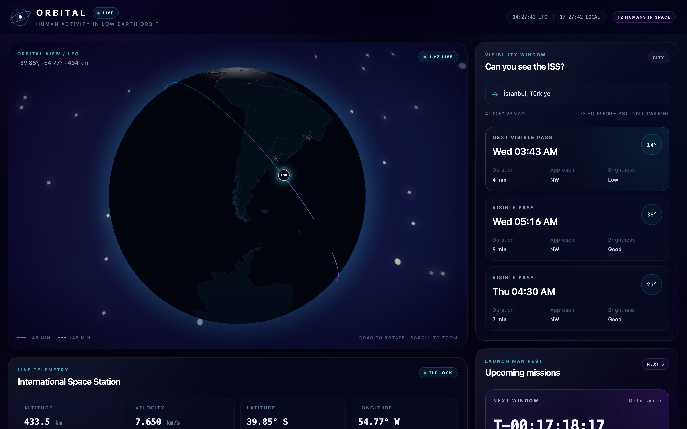
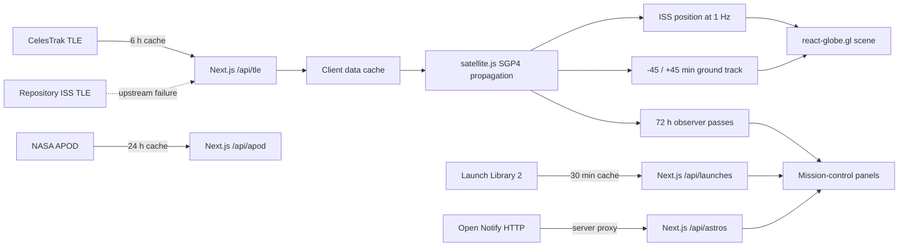

# ORBITAL — Live Space Dashboard 🛰️

**A portfolio-grade, real-time 3D view of human activity in low Earth orbit.** ORBITAL propagates the ISS locally from cached two-line elements, predicts visible passes for the observer, and turns upcoming launch data into a cinematic mission-control interface.



<sub>Captured from a production build (`npm run build && npm run start`) against live upstream data — not a mock, and not a development build. The 375 px capture is [here](./public/screenshots/orbital-mobile-375.png).</sub>

> **Status — Phase 1 (MVP) is built.** Every objective ships as its own pull request, and `scripts/ship-pr.mjs` refuses to merge one without CI plus two independent review verdicts bound to the exact commit being merged. 81 unit tests and 30 end-to-end tests run on every pull request, the latter in both a desktop and a 375 px viewport — 60 browser runs.
>
> Two Definition-of-Done items are **not** met and are not presented as if they were: there is no public deployment yet (no Vercel account is attached to this repository), and the pass prediction has not been compared against an external predictor by a human. Both are tracked openly in [`docs/PHASE_1_DOD.md`](./docs/PHASE_1_DOD.md). No deployment URL, screenshot, Lighthouse score or accuracy figure appears anywhere in this repository until it has actually been measured.

## The first-screen experience

- Night Earth and procedural star field rendered with `react-globe.gl`
- ISS position propagated at 1 Hz with `satellite.js`; no position API polling
- Separate past and future 45-minute ground tracks, split at the antimeridian
- Observer-specific 72-hour pass forecast using twilight, illumination and elevation gates
- Live launch countdowns, launch-pad globe focus, UTC/local clocks and crew count
- Stable loading, stale, fallback and unavailable states across all public upstreams

The visual direction is deep navy/black, restrained cyan and violet telemetry, soft atmosphere, glass instrumentation and cinematic motion with a reduced-motion path.

## Run locally

```bash
npm install
npm run dev
```

Open `http://localhost:3000`. No private runtime API key is required. `NASA_API_KEY` is optional for the Phase 2 APOD card.

To deploy, see [`docs/DEPLOYMENT.md`](./docs/DEPLOYMENT.md) — it needs no secret, no database and no `vercel.json`. For the complete autonomous setup, read [`START_HERE_TR.md`](./START_HERE_TR.md).

## Architecture



### Why client-side propagation?

TLE changes slowly; position changes continuously. Fetching the orbital elements on the server every six hours and propagating any requested timestamp locally gives smooth motion, near-zero upstream pressure, natural time simulation, reproducible pass calculations and useful behavior during transient API failures.

### Resilience model

Each server route validates the upstream response and applies a timeout. Warm server instances can return last-good data; the ISS route has an additional repository fixture. Client panels treat loading, stale, empty and unavailable as designed states rather than exceptions. A launch or crew outage must never take down the globe.

## Core stack

- Next.js App Router + TypeScript strict
- `react-globe.gl` / Three.js
- `satellite.js`
- Tailwind CSS
- Recharts
- SWR
- Vitest + Playwright
- Vercel deployment target

## Test strategy

```bash
npm run lint
npm run typecheck
npm run test
npm run test:coverage
npm run build
npm run test:e2e -- --project=desktop-chromium
npm run test:e2e -- --project=mobile-375
npm run verify
```

Orbital tests use deterministic UTC dates and physical invariants: latitude/longitude bounds, LEO altitude and velocity ranges, chronological pass geometry, visibility gates and antimeridian segmentation. Network behavior is tested at the normalization/proxy boundary with mocked upstreams. Mobile E2E enforces a 375 px no-overflow contract.

CI runs lint, typecheck, unit tests with coverage, a production build, and the full end-to-end suite against **both** Playwright projects, each reporting as its own check. Coverage is measured over the orbital mathematics and the four gateway routes — 96.33% of statements and 90.38% of branches, with `lib/propagation.ts` and `lib/sun.ts` at 100%. Components and hooks are deliberately outside that denominator; they are covered end-to-end instead, so the percentage is not a repository-wide figure.

Resilience is treated as behaviour to assert, not a hope. `e2e/resilience.spec.ts` breaks each upstream in turn — and all three at once — and requires the surface that *owns* the broken feed to name the failure. An outage may not render as an empty state, and an empty response may not render as an outage.

See [`docs/TEST_STRATEGY.md`](./docs/TEST_STRATEGY.md) and [`docs/QUALITY_GATES.md`](./docs/QUALITY_GATES.md).
The package-time validation boundary is recorded in [`docs/PACKAGE_VALIDATION.md`](./docs/PACKAGE_VALIDATION.md).

## Autonomous engineering workflow

The repository is designed to produce an unusually legible public engineering narrative:

```text
roadmap objective → objective branch → red test → implementation → QA review
→ code review → CI → squash PR merge → next dependency-ready objective
```

`CLAUDE.md`, `.claude/agents/`, `.claude/rules/`, `.claude/skills/`, hooks and `goals/roadmap.json` make Claude Code resume work without repeated product questions. Editing agents use isolated worktrees; the lead alone integrates and ships. `setup:github` publishes the machine roadmap as linked issues, while the PR gate enforces allowed paths, chronological TDD evidence, conventional commits and two current-SHA review verdicts.

```bash
npm run claude:auto                         # interactive autonomous lead
npm run autopilot -- --phase phase-1       # MVP-only headless objective loop
npm run mission                              # Phase 1 → 2 → 3, merge-gated
npm run goals -- status                     # local execution ledger
npm run ship:pr -- --objective P1-03        # verify, PR, checks, squash merge
```

## Roadmap

**Phase 1:** hardened gateways, verified propagation, cinematic ISS globe, visible passes, mission-control panels, resilience/mobile/a11y, portfolio release.

**Phase 2:** worker-propagated Starlink sample, ±90-minute simulated time, terminator/shadow detail and APOD.

**Phase 3:** shareable observer URLs, measured Lighthouse/bundle optimization and final release media.

The machine-readable acceptance criteria and dependencies are in [`goals/roadmap.json`](./goals/roadmap.json).

## Data and asset notes

- CelesTrak supplies orbital elements; clients do not call it directly.
- Launch Library 2 supplies upcoming launch metadata.
- Open Notify is proxied server-side because its public endpoint is HTTP.
- The included Earth/star textures are procedurally generated project assets so the starter is self-contained. Replace them only with assets whose license and attribution are recorded.
- Embedded city coordinates are approximate city-centre values and are not suitable for navigation.

## Portfolio evidence checklist

Ticked only where the evidence exists in this repository. Everything unticked is
genuinely outstanding.

- [x] Phase 1 objectives merged through CI as one squashed PR each — [#24](https://github.com/MertArtun/orbital/pull/24), [#28](https://github.com/MertArtun/orbital/pull/28), [#29](https://github.com/MertArtun/orbital/pull/29), [#30](https://github.com/MertArtun/orbital/pull/30), [#31](https://github.com/MertArtun/orbital/pull/31), [#33](https://github.com/MertArtun/orbital/pull/33), [#34](https://github.com/MertArtun/orbital/pull/34)
- [x] API-failure evidence — `e2e/resilience.spec.ts`, per-feed outage and empty states asserted on the owning surface
- [x] Phase 1 Definition of Done mapped criterion by criterion — [`docs/PHASE_1_DOD.md`](./docs/PHASE_1_DOD.md)
- [x] Deployment procedure written and free of private keys — [`docs/DEPLOYMENT.md`](./docs/DEPLOYMENT.md)
- [x] Current desktop and 375 px screenshots, from a production build against live data — [`public/screenshots/`](./public/screenshots/)
- [ ] Public Vercel URL tested in a clean browser session — *no account attached yet*
- [ ] Short real-time ISS movement GIF/video
- [ ] Two pass predictions compared with an external predictor — *record prepared with real ORBITAL output and an empty reference column in [`docs/PASS_VALIDATION.md`](./docs/PASS_VALIDATION.md); the comparison itself is a human step*
- [ ] Production Lighthouse report, without invented scores

## License

Application code is MIT licensed. Upstream data remains subject to each provider’s terms. See attribution files and release documentation before publishing third-party imagery.
