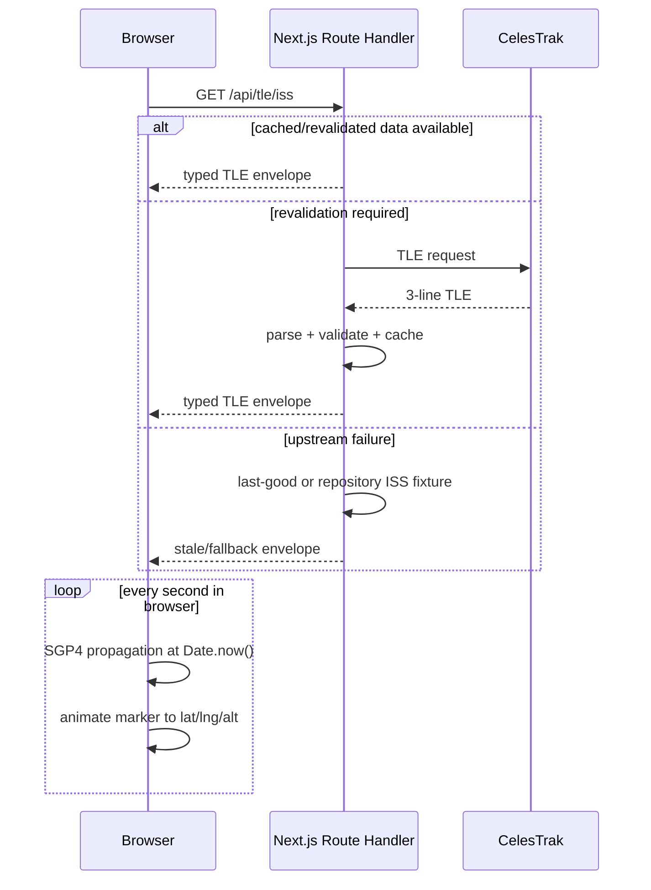

# Architecture

## System boundary

ORBITAL is a stateless Next.js application. Route handlers are a cache/proxy boundary for public upstreams. The browser owns time-dependent orbital propagation and presentation. No database is required.

## Modules

- `lib/tle.ts`: defensive TLE parsing/validation.
- `lib/propagation.ts`: satellite.js wrapper, physical telemetry and antimeridian-safe ground tracks.
- `lib/sun.ts`: solar position, observer twilight and cylindrical Earth-shadow approximation.
- `lib/passes.ts`: observer look angles and visibility-window aggregation.
- `app/api/**`: upstream cache/proxy/fallback boundary.
- `hooks/**`: browser scheduling and SWR orchestration.
- `components/Globe/**`: client-only Three.js integration.
- `workers/**`: Phase 2 bulk Starlink propagation.

## Time model

All computations accept an explicit `Date`. Phase 1 uses current wall-clock time. Phase 2 introduces one canonical simulated timestamp; components must not create independent offsets. Countdowns derive from `target - Date.now()`, not decrementing counters, preventing interval drift.

## Performance budget

- ISS: one satellite propagation per second plus periodic ground-track recomputation.
- Pass prediction: bounded 72-hour scan with explicit step; optimize/refine only after measured need.
- Starlink: maximum 800 records, 1 Hz, Web Worker, batched postMessage.
- 3D globe: dynamically imported, no SSR, stable dimensions, no unnecessary scene recreation.

## Failure containment

Upstream status/shape/timeouts are handled server-side. UI hooks may lose a panel feed without invalidating the global page. The ISS has repository fallback because it is the primary experience. Optional APOD is lazy and non-critical.
