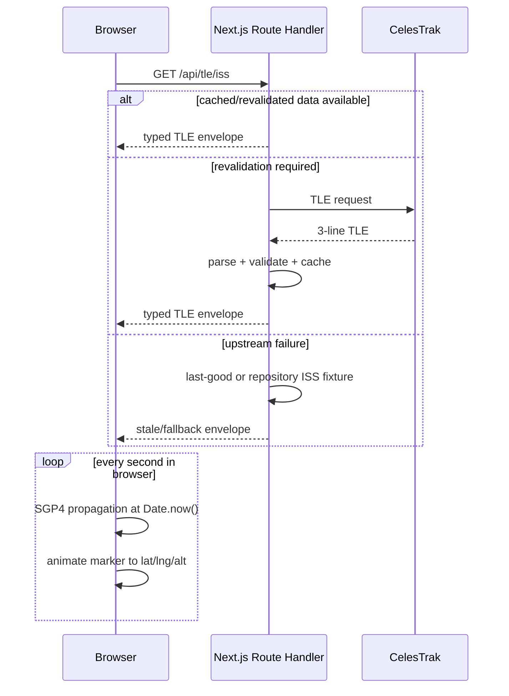

# Architecture

## System boundary

ORBITAL is a stateless Next.js application. Route handlers are a cache/proxy boundary for public upstreams. The browser owns time-dependent orbital propagation and presentation. No database is required.

## Modules

- `lib/tle.ts`: defensive TLE parsing/validation.
- `lib/propagation.ts`: satellite.js wrapper, physical telemetry and antimeridian-safe ground tracks.
- `lib/sun.ts`: solar position, observer twilight, the cylindrical Earth-shadow approximation, and the subsolar point / night polygon / explainable sun state behind the day-night terminator (ADR 0007).
- `lib/passes.ts`: observer look angles and visibility-window aggregation.
- `lib/simulatedTime.ts`: the simulated clock's bounds, clamp and readouts; `hooks/useSimulatedClock.ts` is the only place real time is read for orbital consumers (ADR 0006).
- `lib/shareLink.ts`: strict parsing and privacy-rounded building of shareable observer links; a link outranks browser geolocation (ADR 0008).
- `app/api/**`: upstream cache/proxy/fallback boundary.
- `hooks/**`: browser scheduling and SWR orchestration.
- `components/Globe/**`: client-only Three.js integration.
- `workers/**`: bulk Starlink propagation off the main thread (ADR 0005); `lib/starlink.ts` owns sampling and the fleet maths so the worker stays a thin message adapter.

## Time model

All computations accept an explicit `Date`. Phase 1 used current wall-clock time. Since P2-02 there is one canonical simulated timestamp: `hooks/useSimulatedClock.ts` adds a clamped ±90-minute offset to the 1 Hz real clock and every orbital consumer — ISS marker, ground track, Sun state, Starlink worker — receives that instant as `at` and reads no clock of its own (ADR 0006; `lib/simulatedTime.test.ts` enforces it on the source). Launch countdowns and the top bar stay on real time and derive from `target - Date.now()`, not decrementing counters, preventing interval drift.

## Performance budget

- ISS: one satellite propagation per second plus periodic ground-track recomputation.
- Pass prediction: bounded 72-hour scan with explicit step; optimize/refine only after measured need.
- Starlink: opt-in layer, deterministic sample of at most 800 records, 1 Hz propagation in a module Web Worker, one transferred `Float32Array` per tick rendered as a single `THREE.Points` (see ADR 0005).
- 3D globe: dynamically imported, no SSR, stable dimensions, no unnecessary scene recreation.
- First load: the gzipped JS and CSS a visit to `/` downloads is bounded by `scripts/check-bundle-budget.mjs`, which runs in the verification matrix after `npm run build`. It resolves chunk names from the prerendered HTML rather than a maintained list, because turbopack rehashes them every build; it counts the document's inline `<script>` and `<style>` bytes in the same total, so inlining moves bytes between columns instead of out of the measurement; it fails on any first-paint script or stylesheet served from outside `/_next/static`, which the measurement otherwise cannot see at all; and it fails if three.js is reachable from that HTML — so the globe's laziness is guarded rather than merely true. The telemetry sparkline is behind `next/dynamic` for the same budget: recharts was the single largest chunk of the first load, for a chart below the fold at every viewport. `docs/perf/production-baseline.json` carries the measured bytes; figures are not restated here, because a byte count copied into prose goes stale the first time a dependency moves.
- Measured, not scored: `scripts/measure-perf.mjs` drives the installed Playwright chromium over CDP against a real production server and writes a provenance-stamped report. Byte counts gate; paint and blocking timings are reported as before-and-after deltas from one machine and one session, never as an absolute score. ADR 0009 has the reasoning and the measurement that forced it.

## Failure containment

Upstream status/shape/timeouts are handled server-side. UI hooks may lose a panel feed without invalidating the global page. The ISS has repository fallback because it is the primary experience. Optional APOD is lazy and non-critical: its request is deferred until the card is scrolled near the viewport, it never retries, and its unavailable state keeps the card's dimensions (ADR 0007).
