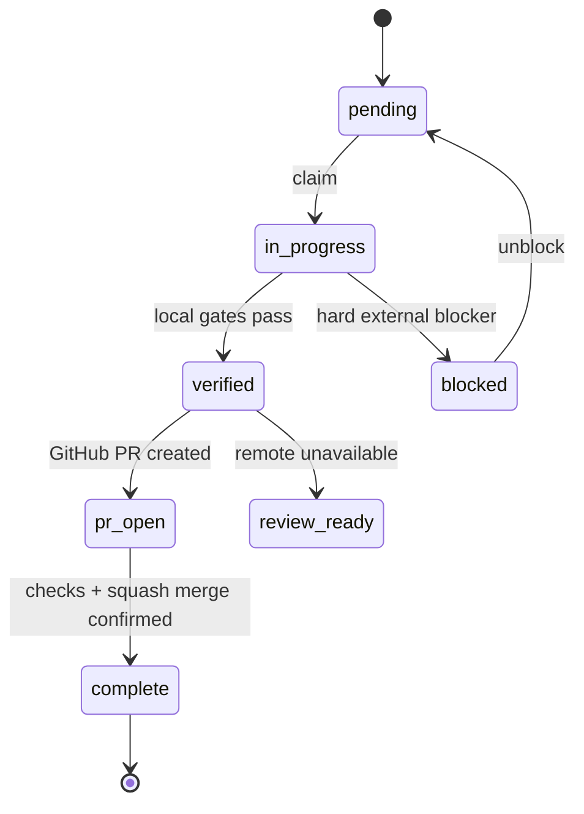

# Autonomous execution playbook

## Objective lifecycle

Dependencies are unlocked only by `complete`, preventing autonomous work from stacking on an unmerged base.

## Lead procedure

1. Inspect local state, Git branch/status and objective acceptance.
2. Ask architect for cross-layer interface/risk map when needed.
3. Create tasks with one owner and explicit paths.
4. Delegate at most two editing tasks concurrently; keep shared types/dependencies/integration local.
5. Require red-green-refactor and commit SHA from each implementer.
6. Integrate, run the objective matrix and full verification.
7. Run independent QA and code review; fix and re-review blocking findings. Bind both final `APPROVE` verdicts to `git rev-parse HEAD` through the structured goal CLI.
8. Ship through `scripts/ship-pr.mjs`; it reruns verification, rejects stale review SHAs and trusts GitHub—not prose—for merge completion.
9. Synchronize merged state, update main and claim the next dependency-ready objective.

## Hard blockers

Valid: GitHub authentication/permission, Vercel ownership, missing real deployment domain, unavailable secret explicitly required by an optional feature, contradictory non-reversible hard requirement.

Invalid: color choice, naming, component split, ordinary test design, reversible visual option, which of two compliant implementations looks stronger. For invalid blockers, decide and proceed.
